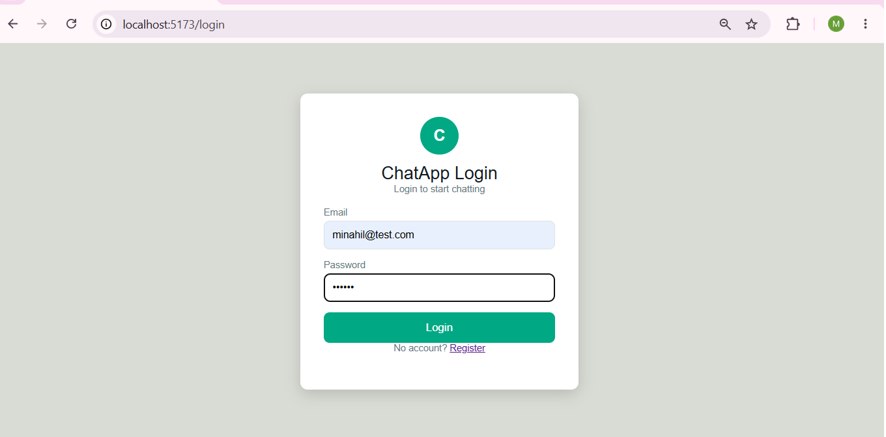
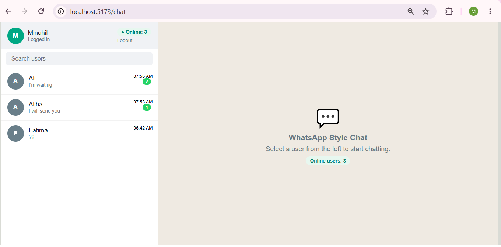
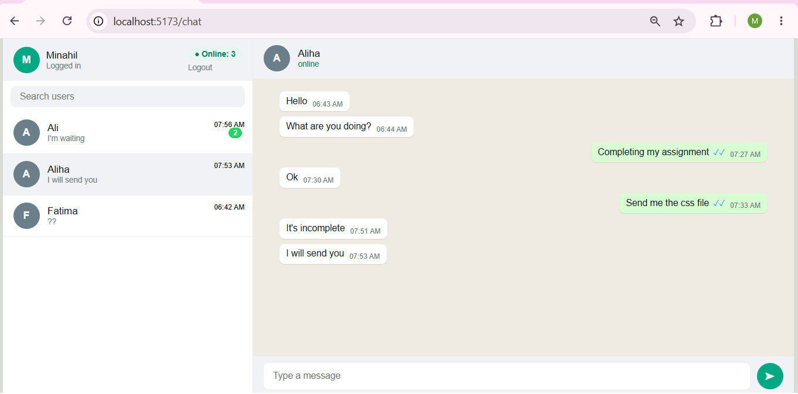
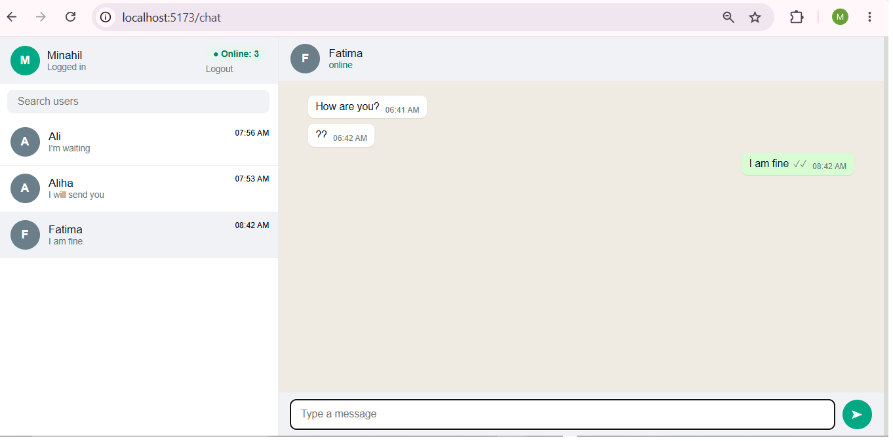
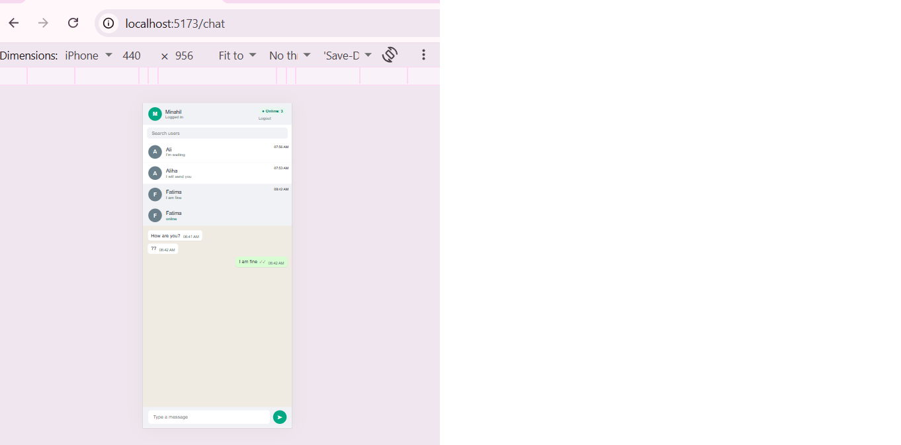
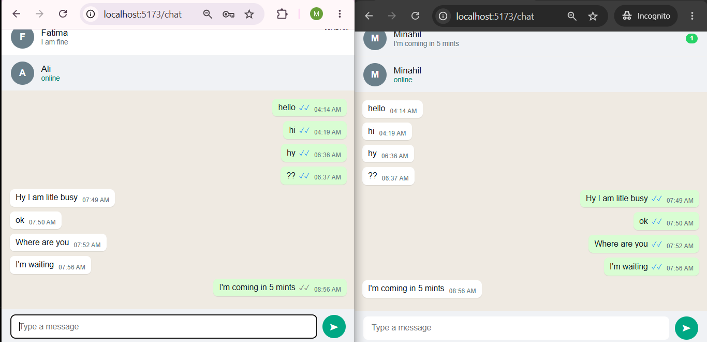

# 💬 WhatsApp Style Chat App

A real-time one-to-one chat application inspired by WhatsApp Web, built using the MERN stack and Socket.IO.

---

## 👩‍💻 Student Information

**Student Name:** Minahil Fatima
**University:** University of Gujrat
**Society:** Hayyatian Computing Society
**Assignment:** WhatsApp Style Chat App
**Instructor:** Kamran Ahsan
**Year:** 2026

---

## 📌 Project Description

This project is a WhatsApp Web-inspired real-time chat application.

Users can register and log in securely, view other registered users, see their online status, open one-to-one conversations, send messages instantly, and receive unread message notifications.

Messages are stored in MongoDB, so chat history remains available after refreshing the page.

Socket.IO provides real-time communication between users without requiring page refreshes.

---

## 🚀 Technologies Used

* React JS with Vite
* Node.js
* Express.js
* MongoDB
* Mongoose
* Socket.IO
* socket.io-client
* JWT Authentication
* httpOnly Cookies
* Axios
* CSS

---

## ✨ Features

### 🔐 Authentication

* User registration
* User login
* User logout
* JWT-based authentication
* JWT stored in an httpOnly cookie
* Protected chat page
* Unauthenticated users are redirected to the login page

### 👥 Users

* Displays all registered users except the logged-in user
* Search users by name
* Live online user count
* Online status indicator
* Multiple browser/tab connections are handled correctly

### 💬 Real-Time Chat

* One-to-one private conversations
* Messages arrive instantly without refreshing
* Previous messages are loaded from MongoDB
* Messages remain available after page refresh
* Sent and received messages have different styles
* Message timestamps are displayed

### 🔔 Unread Messages

* Displays unread message count
* Green unread badge appears beside the user
* Unread count updates in real time
* Opening a conversation marks messages as read
* Unread count becomes zero after opening the chat

### 📱 Responsive Design

* WhatsApp-style desktop interface
* Responsive mobile layout
* Chat interface adapts to smaller screen sizes

---

## 🔌 Socket.IO Events

The application uses the Socket.IO event names required by the assignment.

| Event                | Direction                  | Purpose                                      |
| -------------------- | -------------------------- | -------------------------------------------- |
| `connection`         | Browser → Server           | Authenticates the user and marks them online |
| `disconnect`         | Browser → Server           | Removes the user when the connection closes  |
| `online:count`       | Server → Browser           | Sends the current online user count          |
| `chat:history`       | Browser → Server           | Requests previous messages                   |
| `chat:send`          | Browser → Server           | Sends a new message                          |
| `chat:message`       | Server → Browser           | Delivers a new message instantly             |
| `chat:unread`        | Browser → Server           | Requests unread message counts               |
| `chat:read`          | Browser → Server           | Marks messages as read                       |
| `chat:unread:update` | Server → Browser           | Updates the unread message badge             |
| `chat:typing`        | Browser → Server → Browser | Shows typing status (bonus)                  |

---

## 🗄️ Database

MongoDB with Mongoose is used to store application data.

Chat messages contain:

* Sender
* Receiver
* Message text
* Read/unread status
* Creation time

Messages are retrieved from MongoDB when a conversation is opened, allowing chat history to remain available after refreshing the page.

---

## 🔒 Authentication & Security

The application uses JWT authentication.

The JWT is stored in an `httpOnly` cookie to prevent direct access from client-side JavaScript.

Protected routes verify the authenticated user before allowing access to the chat application.

Environment variables are stored in `.env`.

The real `.env` file is excluded from GitHub using `.gitignore`.

---

## ⚙️ How to Run

### 1. Clone the Repository

```bash
git clone YOUR_GITHUB_REPOSITORY_URL
cd chat-app-assignment
```

### 2. Configure Environment Variables

Create a `.env` file inside the `server` folder.

Example:

```env
PORT=3000
MONGO_URI=mongodb://127.0.0.1:27017/chatapp
JWT_SECRET=your_secret_key
CLIENT_URL=http://localhost:5173
```

The real `.env` file must never be committed to GitHub.

### 3. Start the Server

Open a terminal:

```bash
cd server
npm install
npm run dev
```

The server runs on:

`http://localhost:3000`

### 4. Start the Client

Open another terminal:

```bash
cd client
npm install
npm run dev
```

The client runs on:

`http://localhost:5173`

---

## 🧪 Testing

The application was tested using two browser sessions:

* Normal browser window for User A
* Incognito browser window for User B

The following functionality was tested:

* Registration
* Login
* Logout
* Protected routes
* User list
* Online user count
* Online status
* Loading old messages
* Real-time message delivery
* Unread message badge
* Read messages
* Mobile responsive layout
* Two users chatting simultaneously
* Messages remaining available after refresh

---

## 📸 Screenshots

### 1. Login Page



### 2. User List



### 3. Chat Window



### 4. Unread Message



### 5. Mobile Responsive View



### 6. Two Users Chatting



---

## 🎯 Conclusion

This project demonstrates a complete real-time one-to-one chat application using the MERN stack and Socket.IO.

It provides secure authentication, persistent MongoDB chat history, real-time messaging, online presence, unread message tracking, read status, and responsive design in a WhatsApp-inspired interface.
